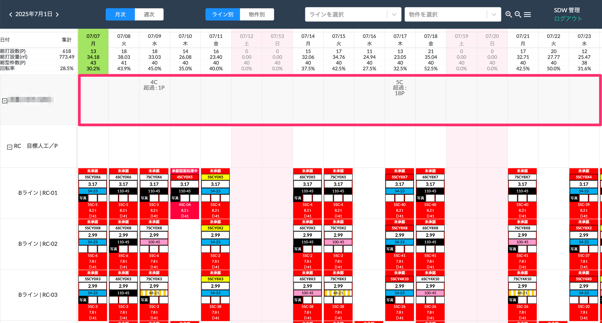
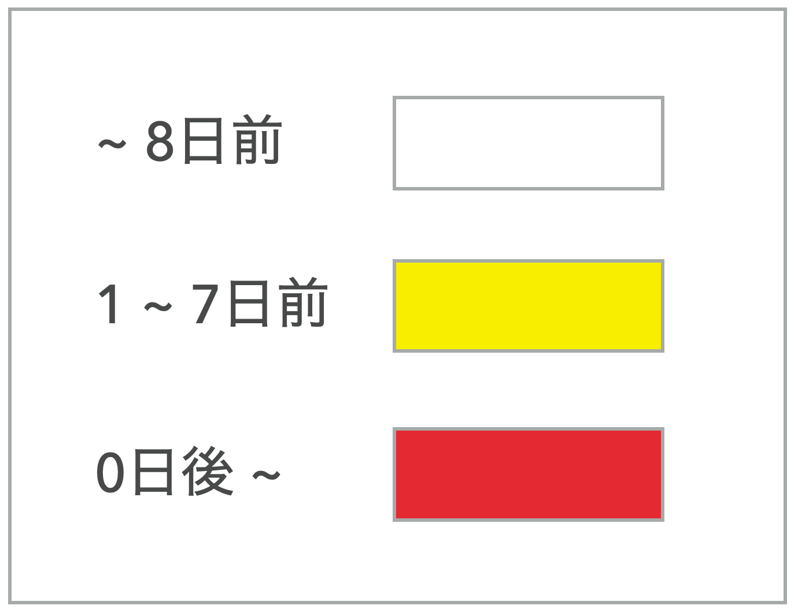
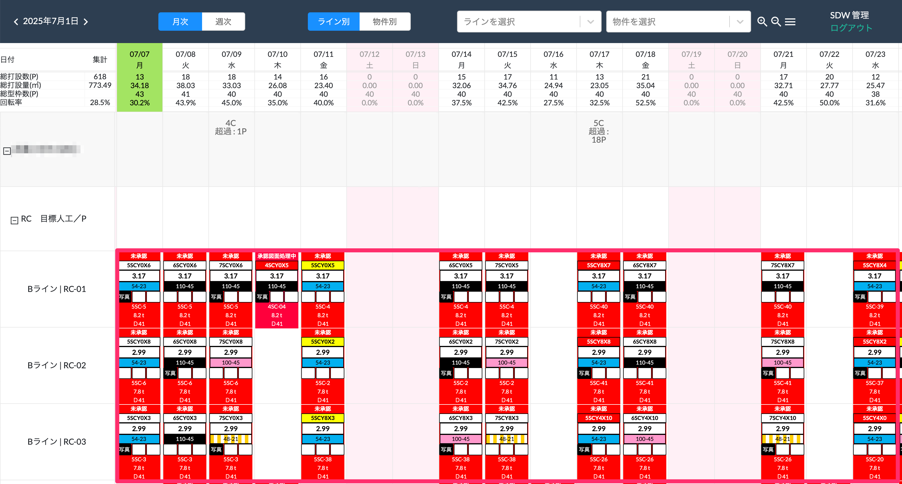

# 打設期限の表示

 

{: .warning }
[打設期限マスタ]()の事前設定が必要です。

各物件ごとに建方区分名とその打設期限を過ぎている製品数(p)を表示します。
<table><tr><td>

</td></tr></table>

 

打設期限と各製品の打設予定日を比較し、以下の条件で製品番号の背景カラーを表示します。

<table><tr><td>

</td></tr></table>

<table><tr><td>

</td></tr></table>

例）打設期限が3/20の場合  
　~3/12： 白  
　3/13~3/19： 黄色  
　3/20~： 赤  