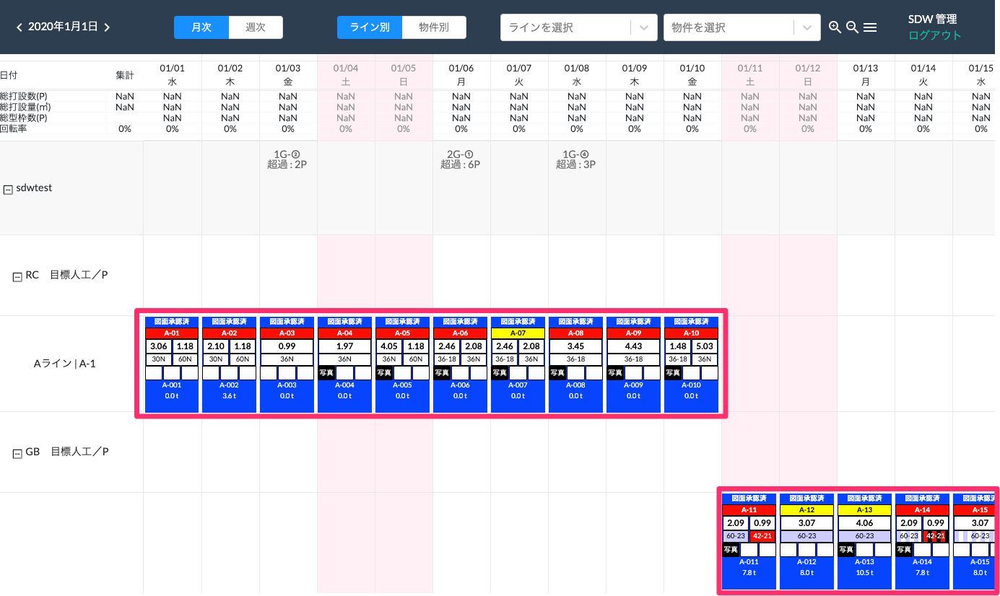
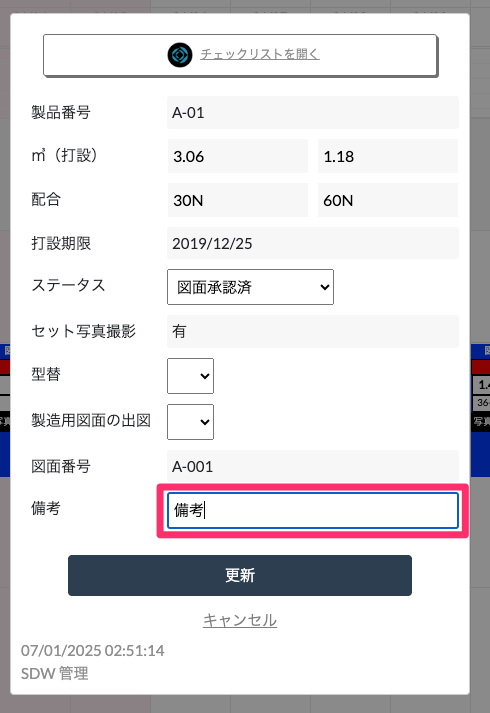
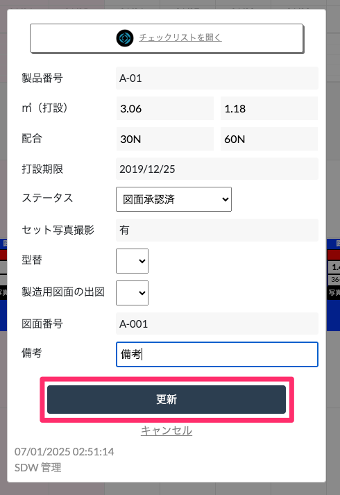
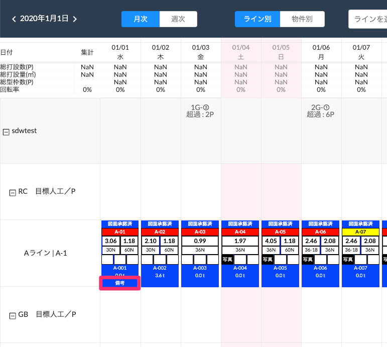
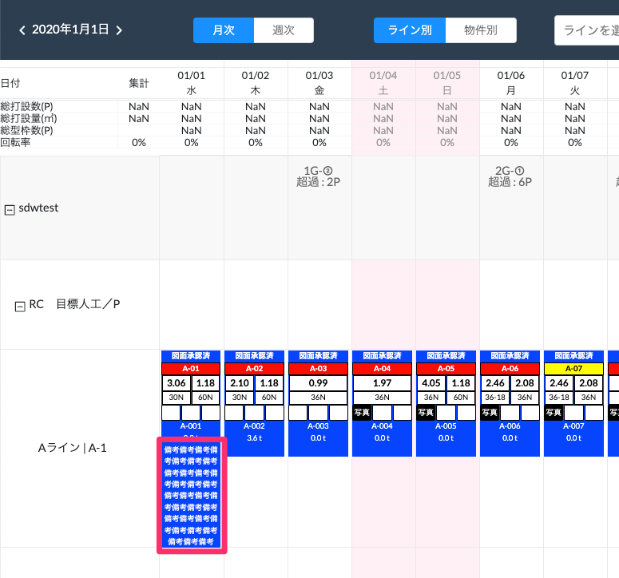

# 備考の記入

 
1. コメントを書きたい製品をクリックします。

    <table><tr><td>
    
    </td></tr></table>

1. 「備考」の項目に任意のコメントを入力します。

    <table><tr><td>
    
    </td></tr></table>

1. 「更新」をクリックします。

    <table><tr><td>
    
    </td></tr></table>

1. WEB工程表に入力したコメントが表示されます。

    <table><tr><td>
    
    </td></tr></table>

1. 入力した備考が長い場合、備考が見切れないよう文字数に応じて行の高さも変動します。

    <table><tr><td>
    
    </td></tr></table>