# コンクリート強度マスタ

目次  
- [概要](#概要)   
- [インポート](#インポート)    
- [手動登録・更新](#手動登録更新)  
- [エクスポート](#エクスポート)  

* * *

## 概要

設定することで、WEB工程表上で任意の配色で配合を表示することができます。  
コンクリート強度マスタは、以下の条件が一致する製品マスタと紐付きます。

- コンクリート強度マスタと製品マスタの[物件コード]が同一  
- コンクリート強度マスタの[コンクリート強度名]と製品マスタの[配合1,2]が同一
- コンクリート強度マスタの[空気量]と製品マスタの[空気量1,2]が同一

 

* * *

## インポート

1. 下記リンクから、コンクリート強度データを入力するエクセルファイルをダウンロードします。  
    [Excelファイルダウンロード](../../../../assets/files/process-control/pre-configuration/registration-combination/combinationMst_format.xlsx "other type of attachments")

    {: .warning }
    ヘッダー名はインポート時の照合に使われているため、変更しないようお願いします。

    <table><tr><td>
    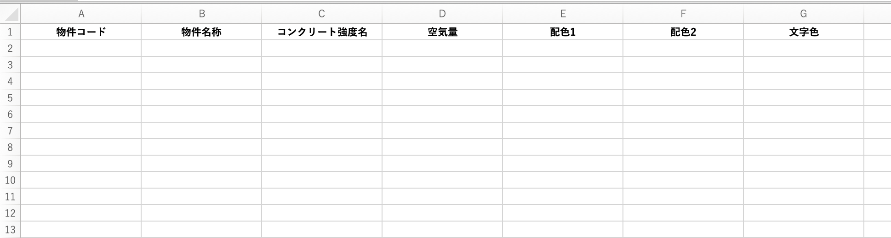
    </td></tr></table>

1. エクセルファイルのフォーマットに沿って、登録したい任意の値を入力します。

    <table><tr><td>
    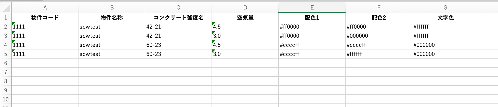
    </td></tr></table>

    {: .warning }
    配色1,2と文字色は#付きのカラーコードで入力してください。

1. [基幹システム]TOP画面から「コンクリート強度」をクリックし、[コンクリート強度一覧]画面に遷移します。

    <table><tr><td>
    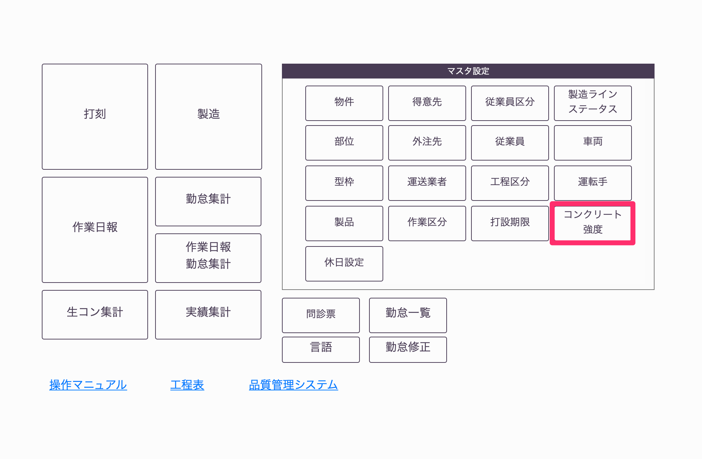
    </td></tr></table>

1. 画面右上の「エクセルインポート」をクリックし、インポートするファイルを選択します。

    <table><tr><td>
    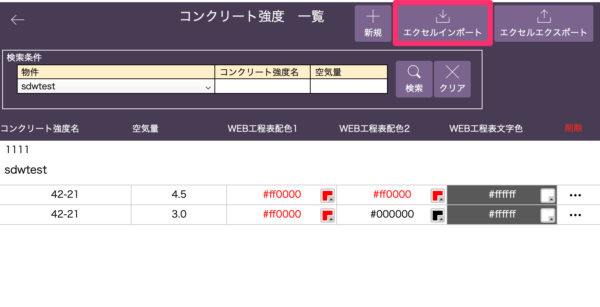
    </td></tr></table>

    <table><tr><td>
    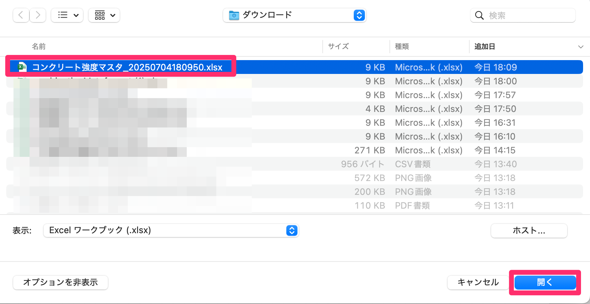
    </td></tr></table>

1. [インポート順の設定]で以下の設定を確認し「インポート」をクリックします。  
    2回目以降は設定が記憶されるため、設定を変更せずにインポート可能です。  
     

    【初回】  
    ① 1/xxx  
    ② 「フィールド名として使用」  
    ③ 「照合名順」  

    【二回目以降の表示】  
    ① 2/xxx  
    ② 「データ」  
    ③ 「照合名順」  

    <table><tr><td>
    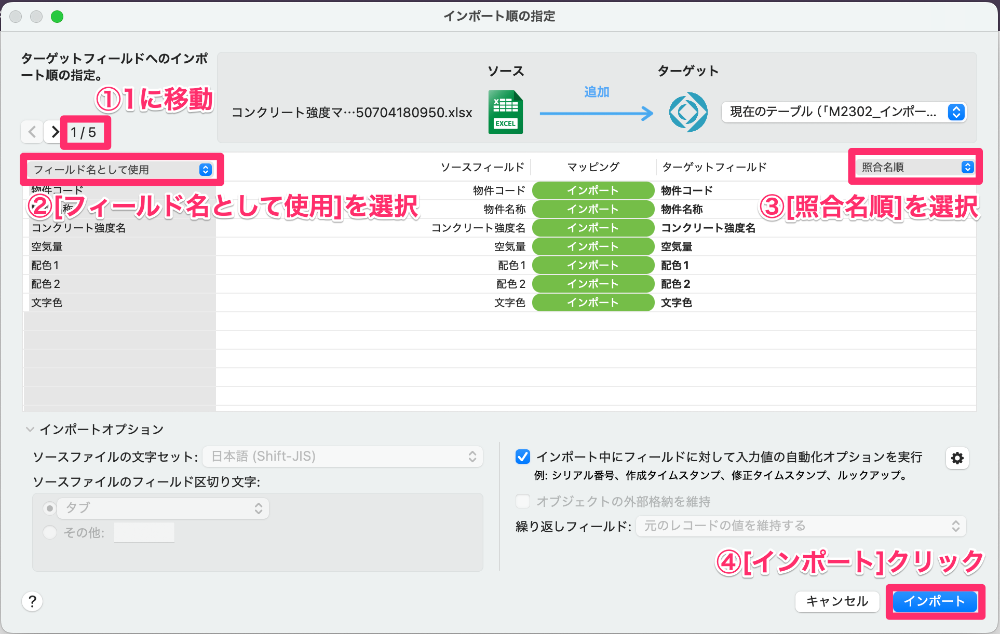
    </td></tr></table>

1. [コンクリート強度インポート確認]画面で内容を確認し、問題なければ「インポート」をクリックします。  

    インポートステータスは以下の通りです。

    <table><tr><td>
    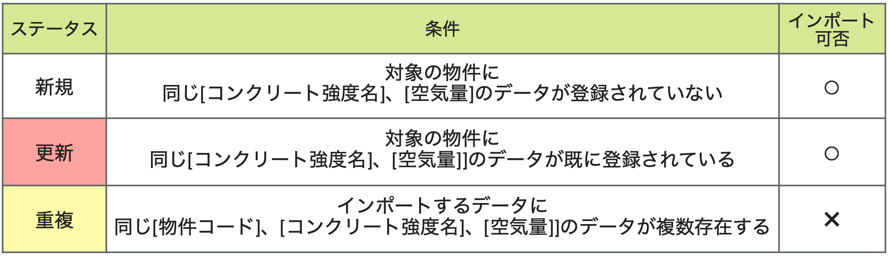
    </td></tr></table>

    <table><tr><td>
    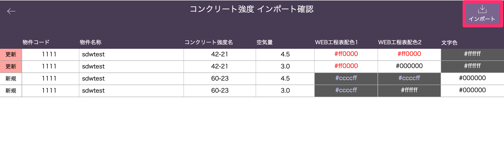
    </td></tr></table>

1. [コンクリート強度一覧]画面にインポートしたコンクリート強度が表示されます。

    <table><tr><td>
    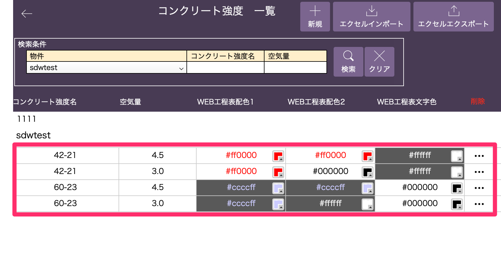
    </td></tr></table>

 

* * *

## 手動登録・更新

1. [コンクリート強度一覧]画面の「新規」をクリックします。

    <table><tr><td>
    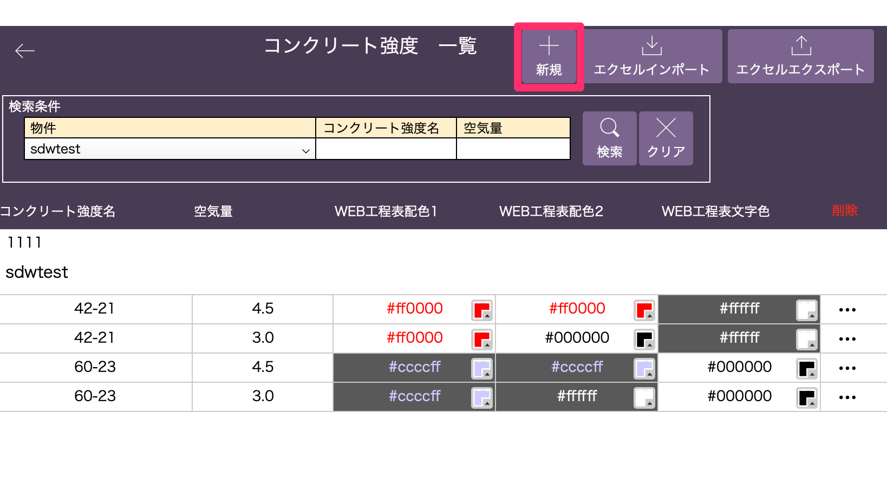
    </td></tr></table>

1. 登録したい物件名称を選択して「作成」をクリックします。

    <table><tr><td>
    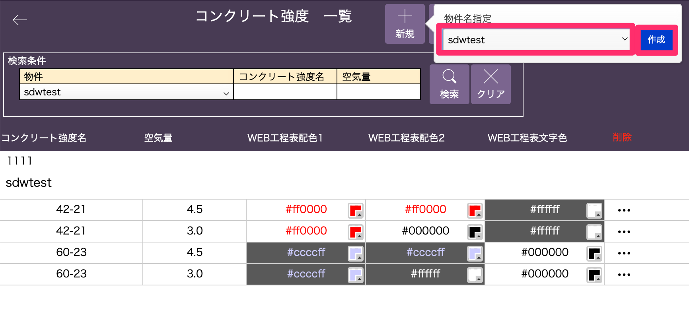
    </td></tr></table>

1. 登録・更新したい内容を手動入力します。
  
    <table><tr><td>
    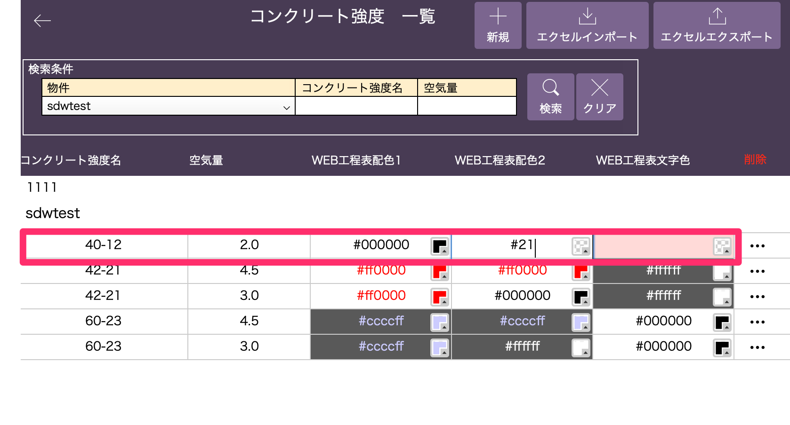
    </td></tr></table>

    {: .warning }
    カラーコードの入力は[製造ラインステータス設定]()を参考にしてください。

 

* * *

## エクスポート

1. エクスポートしたいデータを検索で絞り込みます。

    <table><tr><td>
    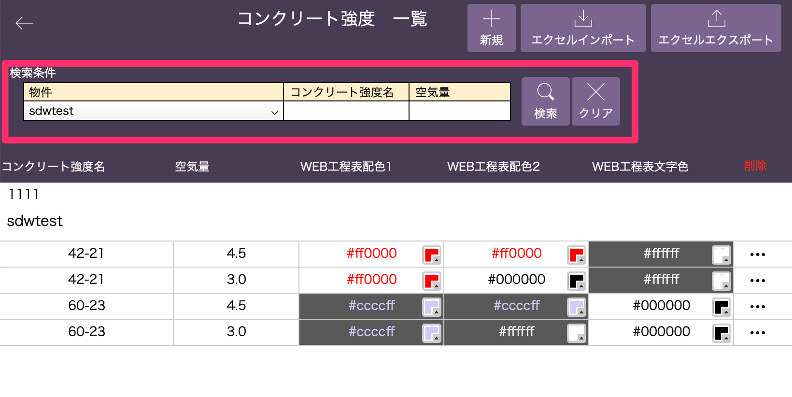
    </td></tr></table>

1. 「エクスポート」をクリックし、ファイル名を指定して「OK」をクリックします。

    <table><tr><td>
    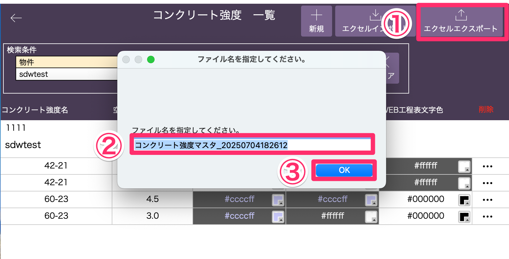
    </td></tr></table>

1. 出力先を選択して「保存」をクリックします。

    <table><tr><td>
    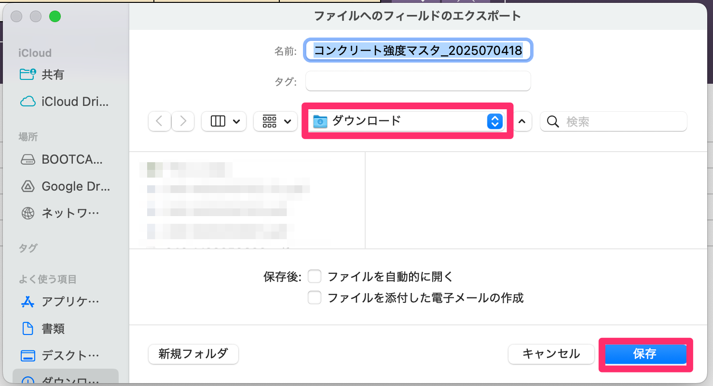
    </td></tr></table>

1. コンクリート強度マスタをExcel形式でエクスポートすることができます。

    <table><tr><td>
    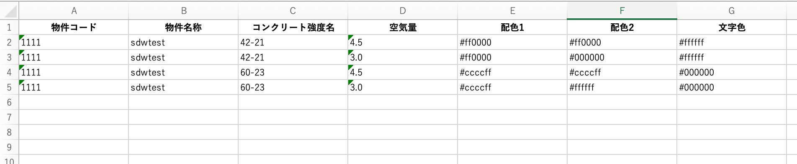
    </td></tr></table>