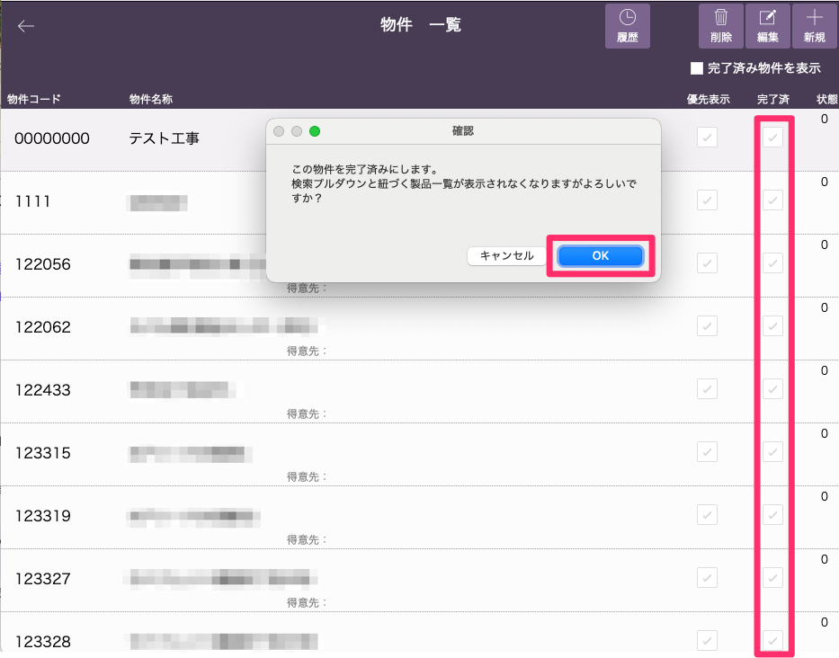
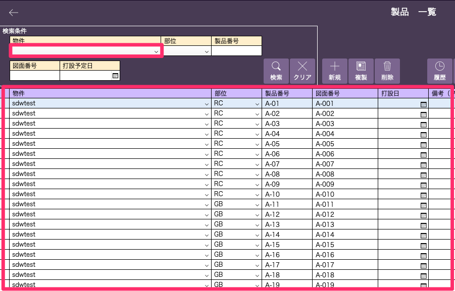
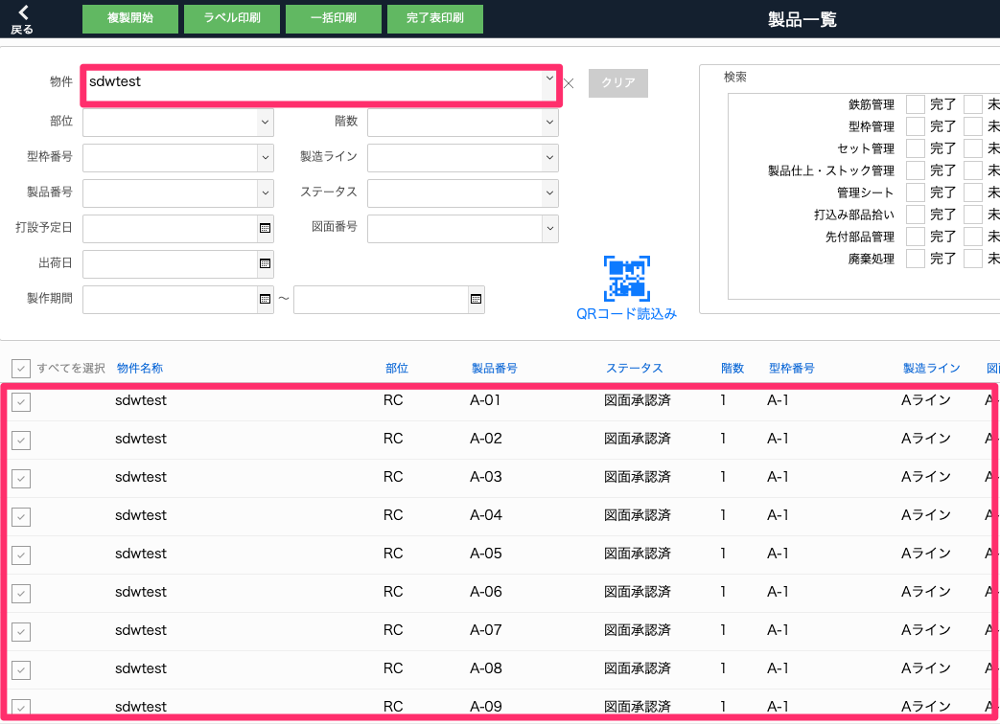
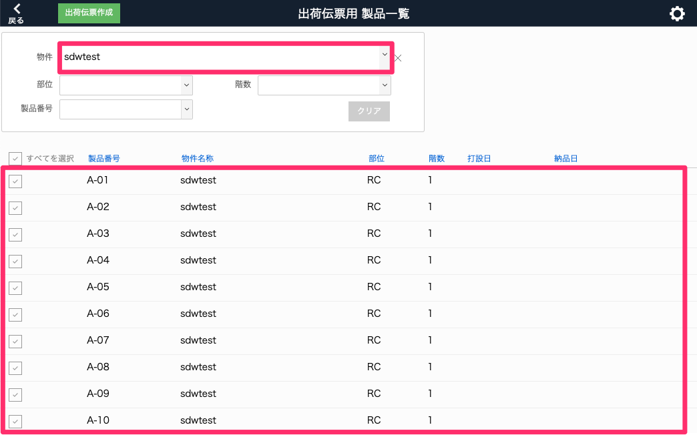

# 完了済物件と紐づく製品非表示

1. 物件マスタ一覧画面の完了済チェックボックスにチェックをつけ、物件を完了済にします。

    <table><tr><td>
    
    </td></tr></table>
     

1. 完了済となった物件は、物件マスタ一覧画面から非表示となります。

    {: .note }
    非表示となった物件は、物件マスタ一覧画面右上の「完了済み物件を表示」にチェックで表示することができます。

     

1. 以下3画面の物件プルダウンとその物件に紐づく製品が非表示となります。
    <table><tr><td>
    
    </td></tr></table>
     

    <table><tr><td>
    
    </td></tr></table>
     

    <table><tr><td>
    
    </td></tr></table>