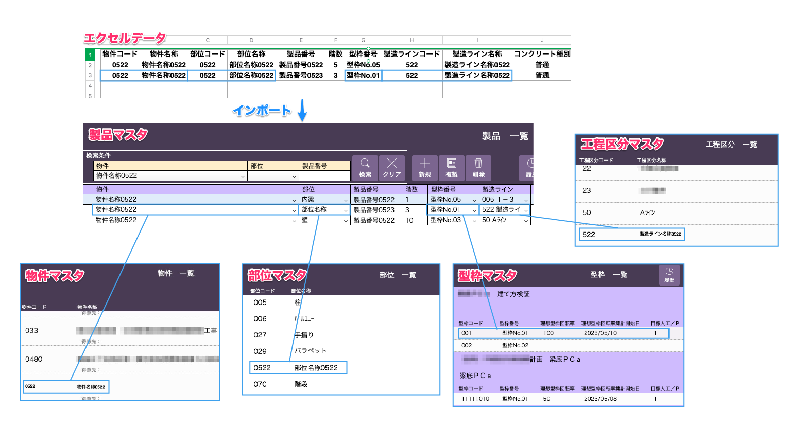
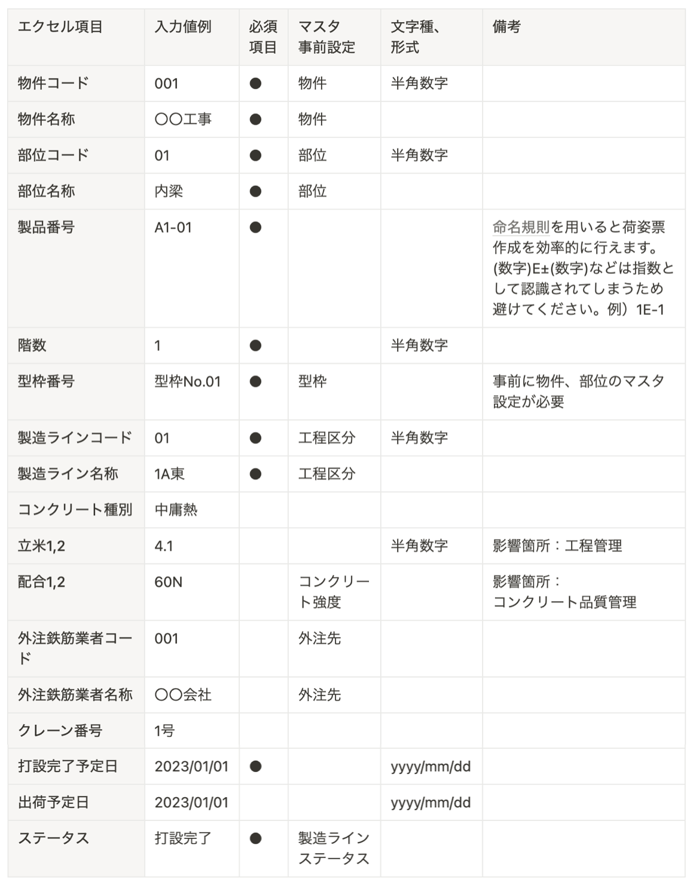

# 事前設定

 
<table><tr><td>

</td></tr></table>

製品マスタをシステムにインポートする前に、各マスタに項目内容を設定する(後述)必要があります。
製品マスタの項目と関連するマスタ、入力必須項目は以下の表をご参照ください。  

| エクセル項目 | 入力値例 | 必須 項目 | マスタ 事前設定 | 形式 | 備考 | 
| --- | --- | --- | --- | --- | --- | 
| 物件コード | 001 | ⚫︎ | 物件 | 半角数字 |   | 
| 物件名称 | 〇〇工事 | ⚫︎ | 物件 |  |  | 
| 部位コード | 01 | ⚫︎ | 部位 | 半角数字 |  | 
| 部位名称 | 内梁 | ⚫︎ | 部位 |  | 
| 製品番号 | 1A-01 | ⚫︎ |  |  | (数字)E±(数字)などは指数として 認識されるため避けてください。 例)1E-1 | 
| 図面番号 | 1G-01 |  |  |  |  | 
| 打設日 | 2020/01/01 |  |  | yyyy/mm/dd |  | 
| 備考フリー |  |  |  |  |  | 
| 階数 | 1 | ⚫︎ |  | 半角数字 |  | 
| ステータス | 図面承認済 | ⚫︎ | 製造ラインステータス |  |  | 
| 製造ラインコード | 01 | ⚫︎ | 工程区分 | 半角数字 |  | 
| 製造ライン名称 | 1ライン | ⚫︎ | 工程区分 |  |  | 
| 型枠番号 | A-01 | ⚫︎ | 型枠 |  | 事前に物件、部位のマスタ設定が必要 | 
| 打設完了予定日 | 2020/01/01 | ⚫︎ |  | yyyy/mm/dd |  | 
| テクノ備考 |  |  |  |  |  | 
| 建方区分 | 1G-3 |  | 打設期限 |  |  | 
| 建方想定日 | 2020/01/01 |  | 打設期限 | yyyy/mm/dd | 打設期限マスタの値自動入力 影響箇所:WEB工程表 | 
| 打設期限 | 2020/01/01 |  | 打設期限 | yyyy/mm/dd | 打設期限マスタの値自動入力 影響箇所:WEB工程表 | 
| 納品日 | 2020/01/01 |  |  | yyyy/mm/dd | 出荷伝票出力時に自動入力 | 
| 廃棄日 | 2020/01/01 |  |  | yyyy/mm/dd |  | 
| 配合1,2 | 36N |  | コンクリート強度 |  | 影響箇所: コンクリートマスタ WEB工程表 | 
| 空気量1,2 | 4.5 |  | コンクリート強度 | 半角数字 | 影響箇所: コンクリートマスタ WEB工程表 | 
| 立米1,2 | 3.2 |  |  | 半角数字 |  | 
| c_打設1,2 | 2.1 |  |  | 半角数字 | 立米×0.985を 小数点第2位で四捨五入  | 
| 積算重量1,2 | 2.34 |  |  | 半角数字 |  | 
| 打設重量1,2 | 5.10 |  |  | 半角数字 |  | 
| セット写真撮影 | 有 |  |  | 有/空欄 |  | 
| 配筋写真撮影 | 有 |  |  | 有/空欄 |  | 
| 型替 | 有 |  |  | 有/無/空欄 |  | 
| 製造用図面の出図 | 済 |  |  | 済/空欄 |  | 
| 型枠業者 | 〇〇工業 |  |  |  |  | 
| 鉄筋業者 | 〇〇工業 |  |  |  |  | 
| 打設業者 | 〇〇工業 |  |  |  |  | 

<!--  -->