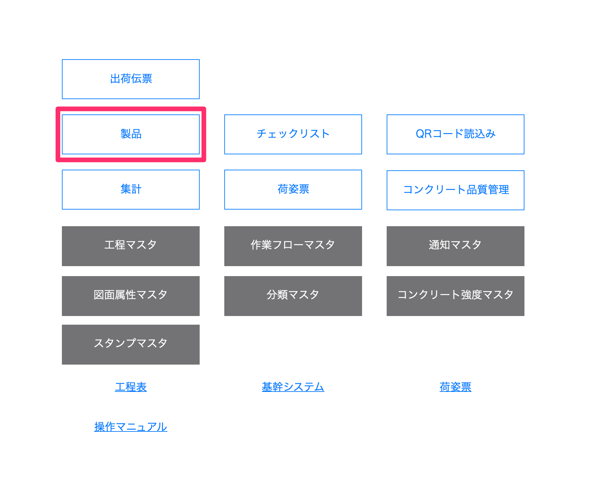
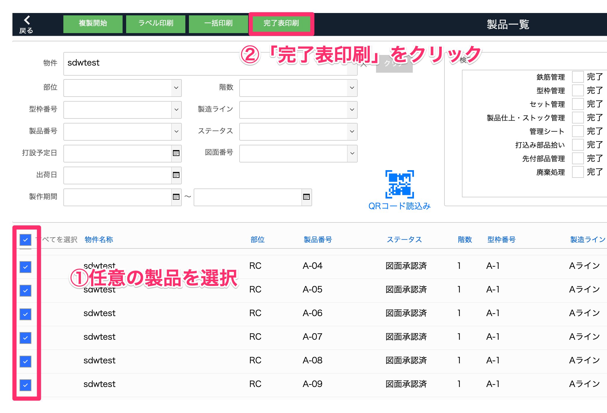
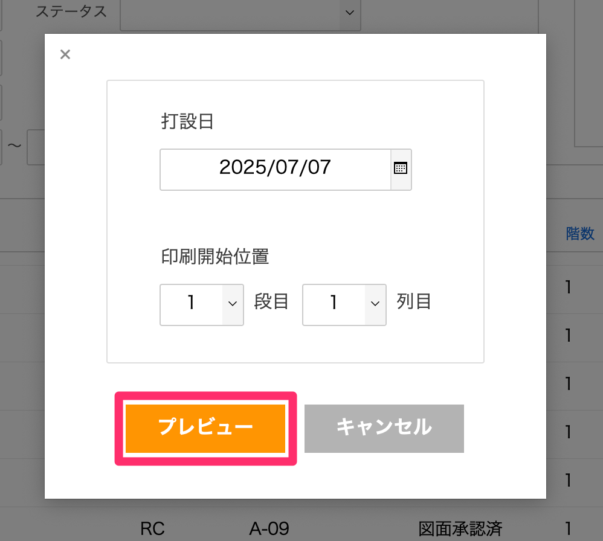
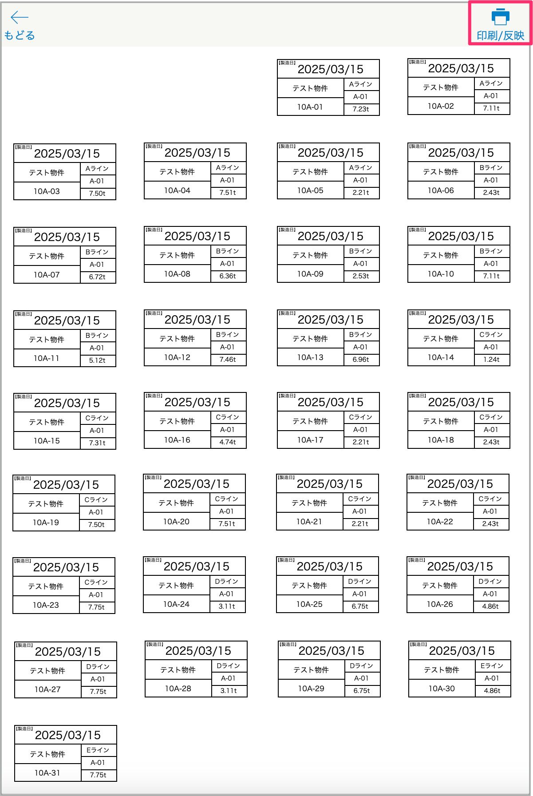
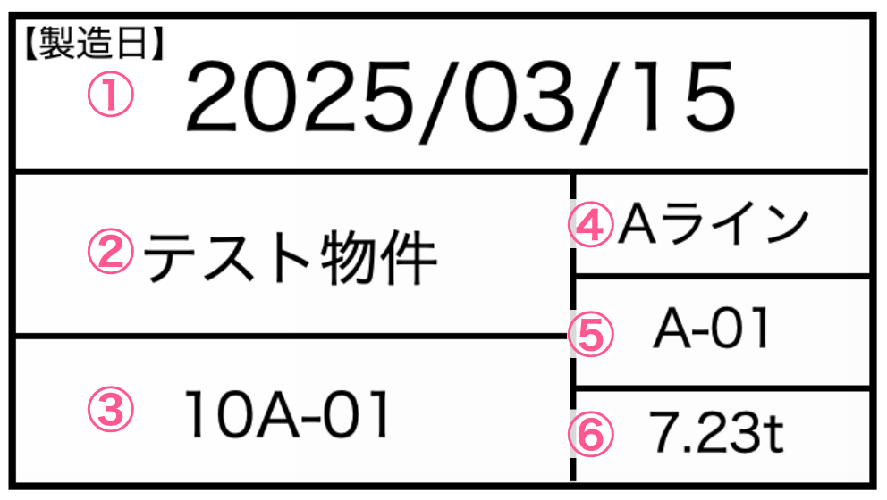

# 打設完了製品表を印刷する

1. [品質管理システム]トップ画面から「製品」を選択します。

    <table><tr><td>
    
    </td></tr></table>

1. [製品一覧]で完了表印刷したい製品を検索してチェックボックスにチェックを入れるか全てを選択し、「完了表印刷」を選択します。

    <table><tr><td>
    
    </td></tr></table>

1. 打設日と印刷開始位置を選択して「プレビュー」をクリックします。

    <table><tr><td>
    
    </td></tr></table>

1. 「印刷/反映」クリックで選択した製品の完了表印刷を行います。

    <table><tr><td>
    
    </td></tr></table>

    {: .note }
    「印刷/反映」をクリックしたタイミングで、設定した[打設日]が製品マスタの[打設日]に自動で反映されます。

    <table><tr><td>
    
    </td></tr></table>

    打設完了製品表内容

    ① 設定した打設日  
    ② 物件マスタ：名称  
    ③ 製品マスタ：製品番号  
    ④ 製品マスタ：製造ライン名称  
    ⑤ 製品マスタ：型枠番号  
    ⑥ 製品マスタ：重量1(積算)＋重量2(積算)t  
    　　　　　　　→少数第2位まで表示  