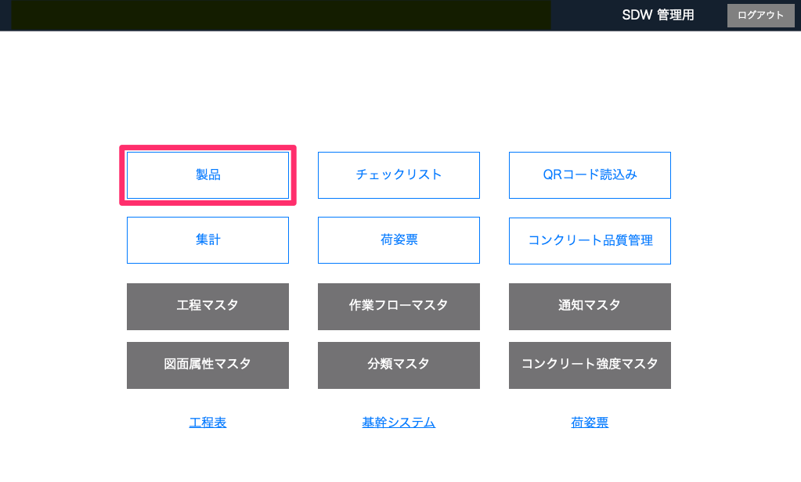
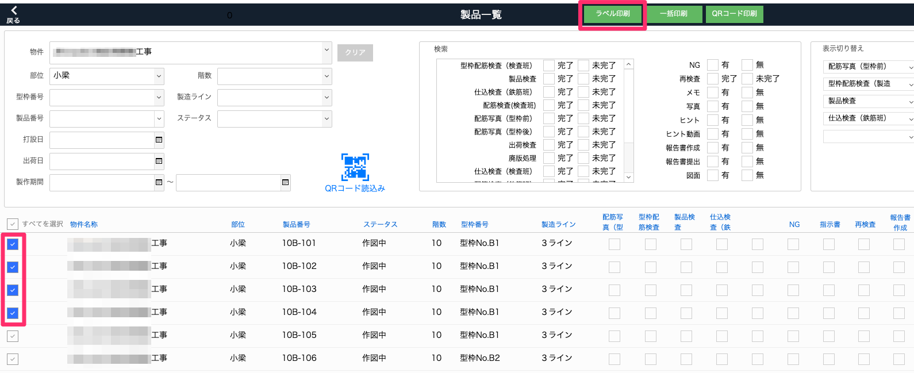
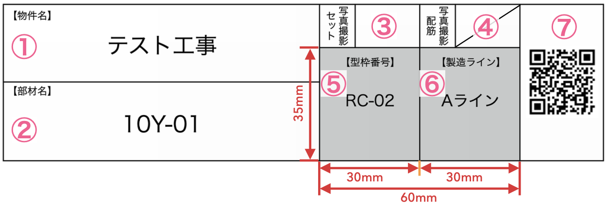

# 製品のラベルを印刷する

### ラベルのQRコードを作業者がiPadで読み取り、製品のチェックリストにスムーズにアクセスできるようになります。

1. [品質管理システム]トップ画面から「製品」を選択します。

    <table><tr><td>
    
    </td></tr></table>

1. [製品一覧]でラベル印刷したい製品を検索してチェックボックスにチェックを入れるか全てを選択し、「ラベル印刷」を選択します。

    <table><tr><td>
    
    </td></tr></table>

1. 「印刷」クリックで選択した製品のラベル印刷を行います。

    <table><tr><td>
    
    </td></tr></table>

    ラベル内容

    ① 物件マスタ：名称（2行まで表示可）  
    ② 製品マスタ：製品番号（2行まで表示可）  
    ③ 空欄  
    ④ 製品マスタ：配筋写真撮影が空欄の場合に斜線表示  
    ⑤ 製品マスタ：型枠番号（背景グレー）  
    ⑥ 製品マスタ：製造ライン名称（背景グレー）  
    ⑦ QRコード（mst製品：UUID）  