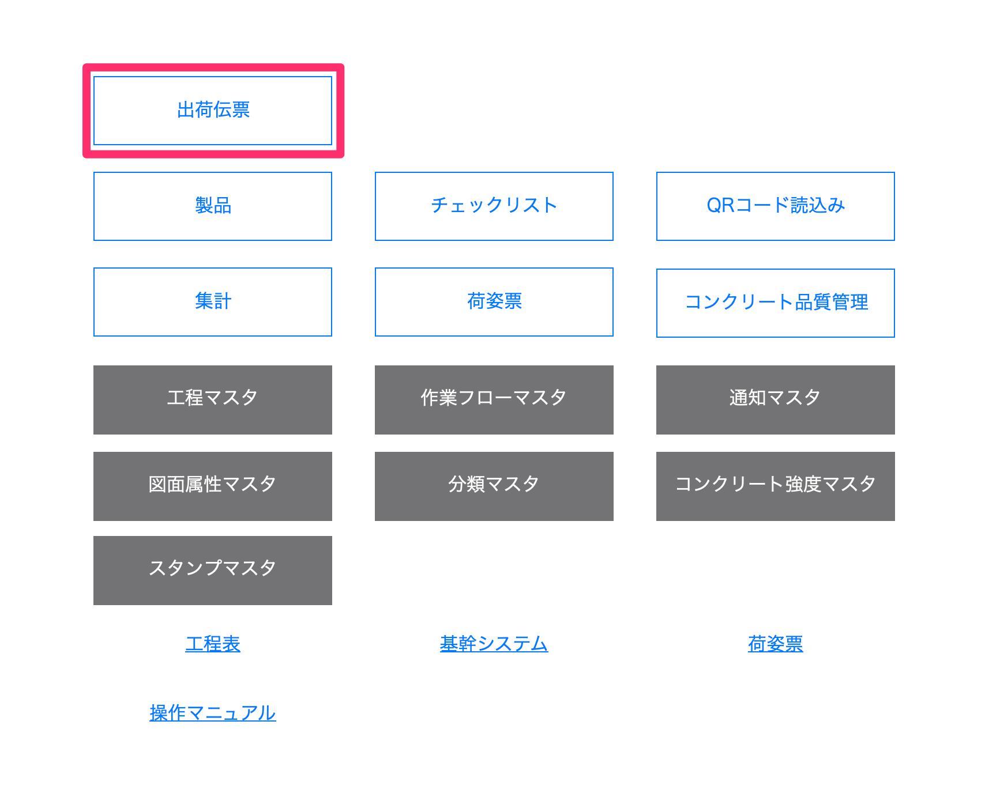
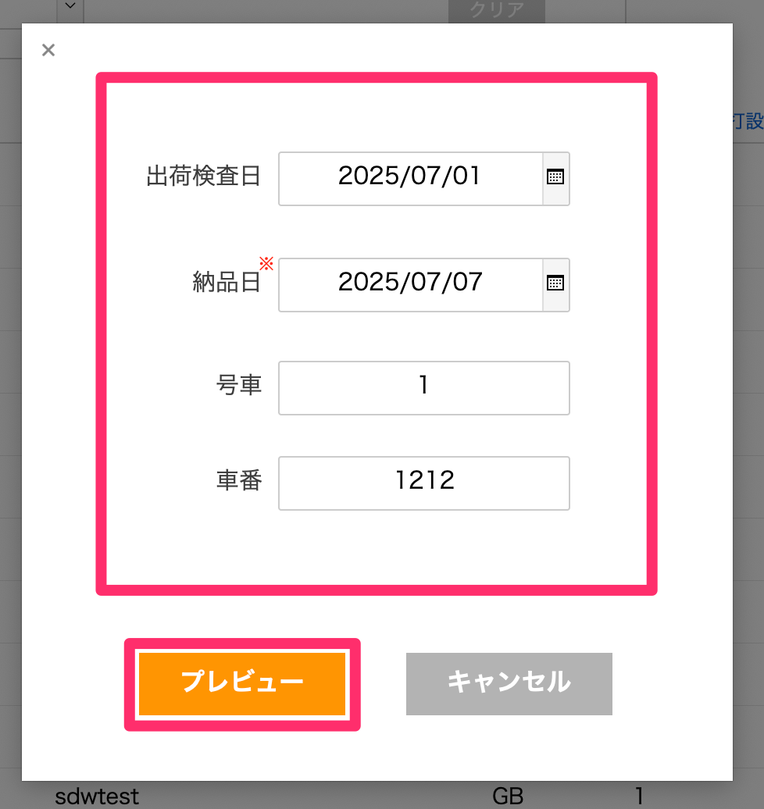
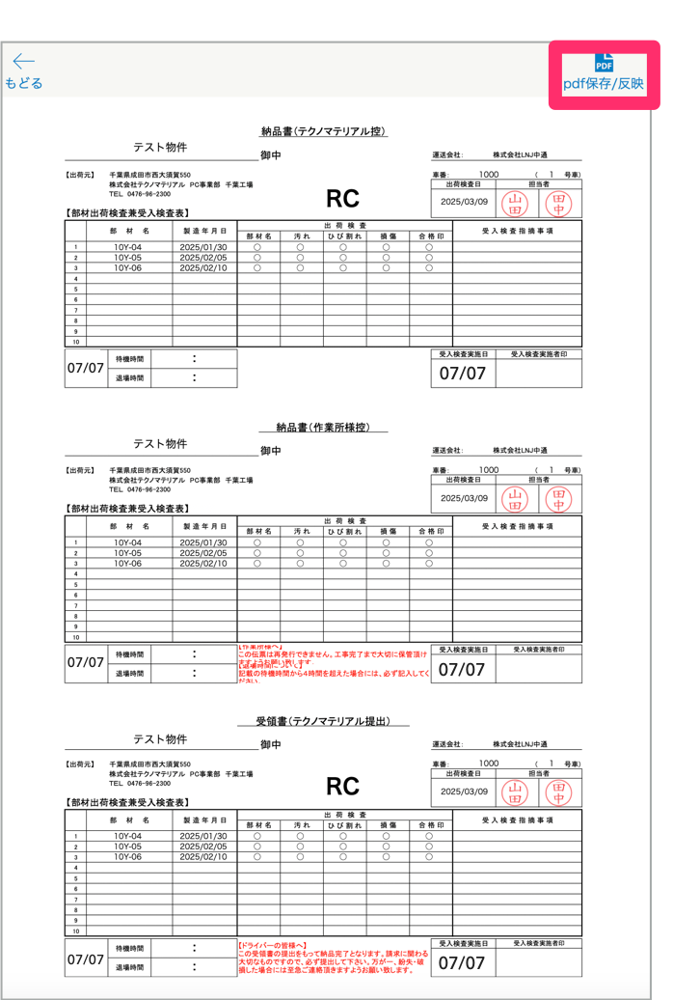
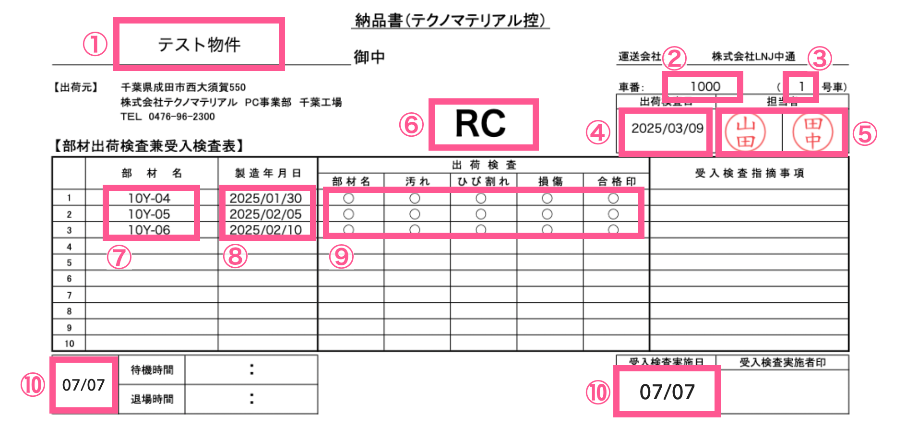
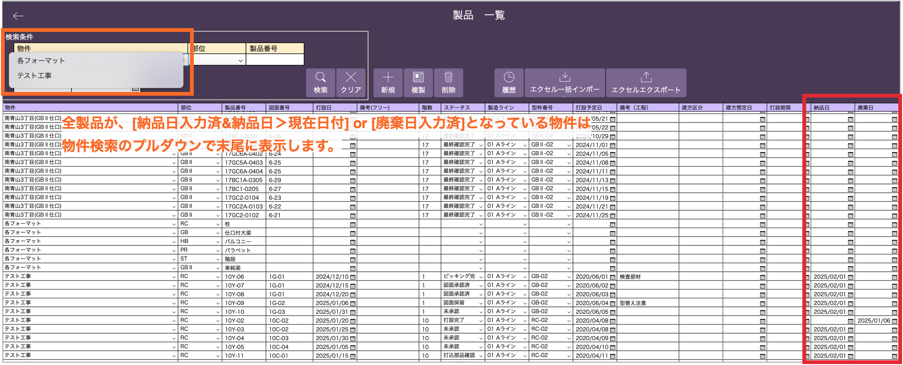

# 出荷伝票出力

 

1. [品質管理システム]トップ画面から「出荷伝票」を選択します。

    <table><tr><td>
    
    </td></tr></table>

1. [出荷伝票用 製品一覧]で製品を絞り込んでチェックボックスにチェックを入れ、「出荷伝票作成」をクリックします。

    <table><tr><td>
    
    </td></tr></table>

    「出荷伝票作成」クリック時に以下の条件に当てはまる場合、確認/エラーメッセージを表示します。
     - 納品日がすでに入力済の製品を選択 → **確認メッセージ**
     - 10件を超える製品を選択 → **エラーメッセージ**
     - 複数の異なる部位を選択 → **エラーメッセージ**

1. 出荷伝票に記載する項目を入力し、「プレビュー」をクリックします。

    <table><tr><td>
    
    </td></tr></table>

    {: .warning }
    納品日の入力は必須となります。
    

1. 「pdf保存/反映」クリックで選択した製品の完了表印刷を行います。

    <table><tr><td>
    
    </td></tr></table>

    {: .note }
    「pdf保存/反映」をクリックしたタイミングで、設定した[納品日]が製品マスタの[納品日]に自動で反映されます。

    <table><tr><td>
    
    </td></tr></table>

    出荷伝票内容

    ① 物件マスタ：正式名称  
    ② 設定した車番  
    ③ 設定した号車  
    ④ 設定した出荷検査日  
    ⑤ 設定した担当印  
    ⑥ 製品マスタ：部位名称(作業所様控は表示なし)  
    ⑦ 製品マスタ：製品番号  
    ⑧ 製品マスタ：打設日  
    ⑨ 製品が表示されている行に○  
    ⑩ 設定した納品日

* * *

## 物件検索プルダウン表示順変更

 

物件に紐づく全製品が下記の条件を満たす場合、検索プルダウンで該当の物件を末尾に表示します。
- 納品日入力済 & 納品日＞現在日付 or 廃棄日入力済

<table><tr><td>

</td></tr></table>