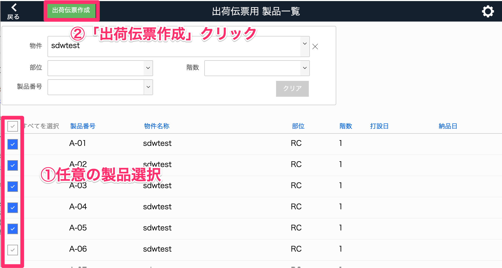
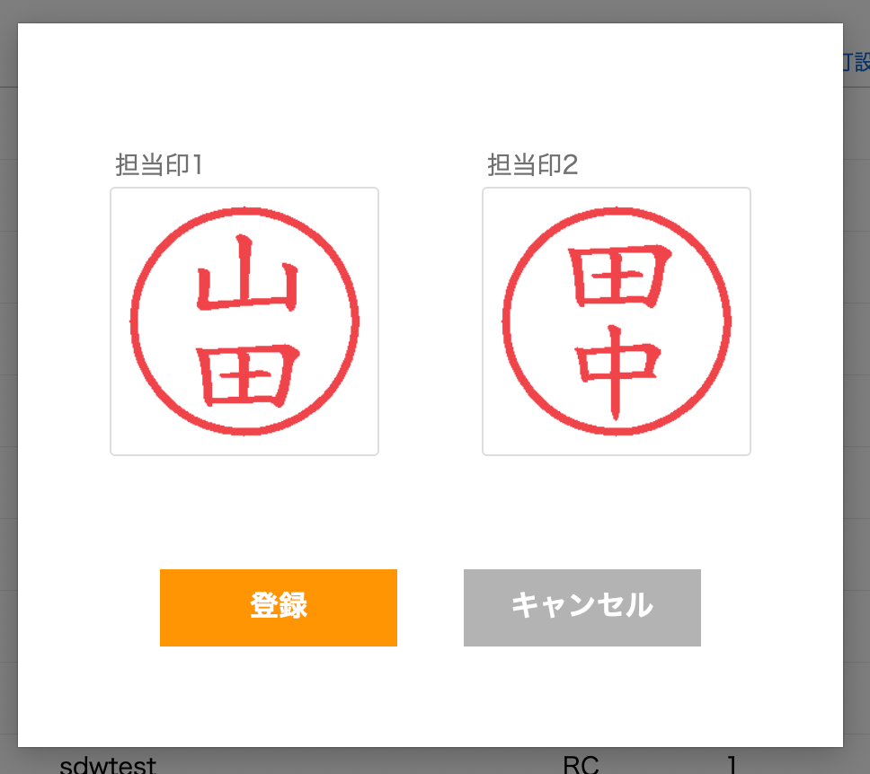
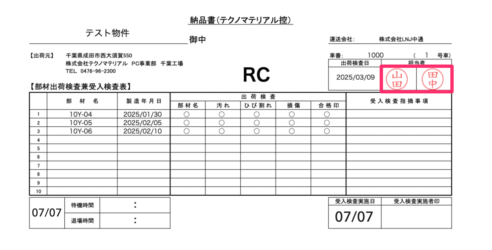

# 担当印設定

 

1. [品質管理システム]トップ画面から「出荷伝票」を選択します。

    <table><tr><td>
    
    </td></tr></table>

1. [出荷伝票用 製品一覧]画面右上の歯車マークをクリックします。

    <table><tr><td>
    
    </td></tr></table>

1. 出荷伝票に表示する担当印を挿入し、「登録」をクリックします。

    <table><tr><td>
    
    </td></tr></table>

1. 出荷伝票の[担当者]に登録した担当印が表示されます。

    <table><tr><td>
    
    </td></tr></table>